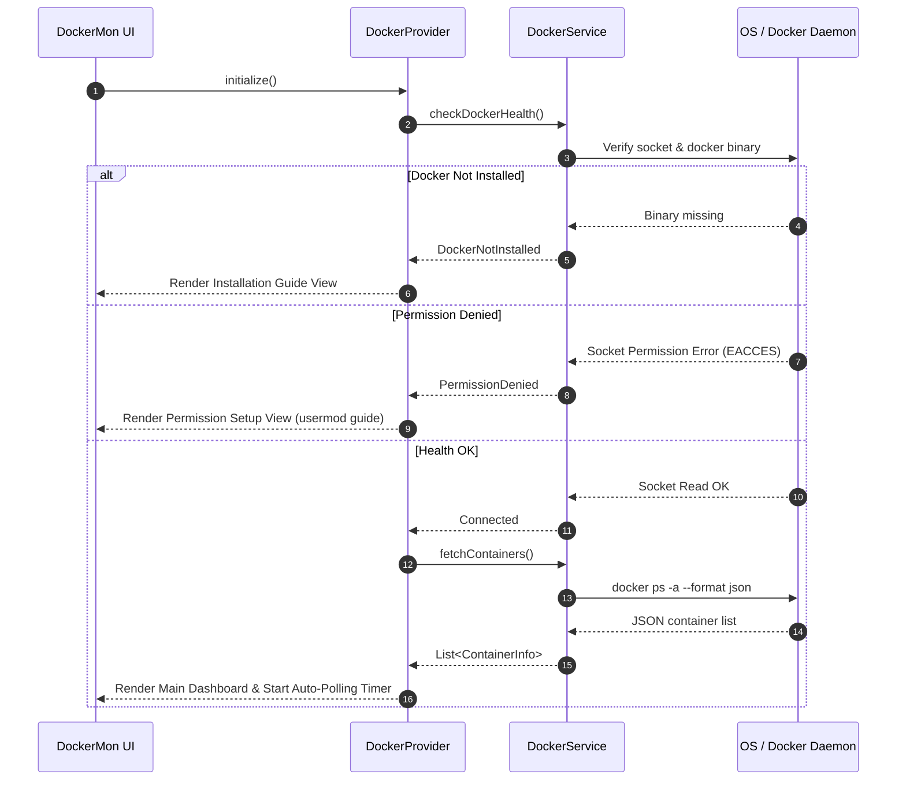
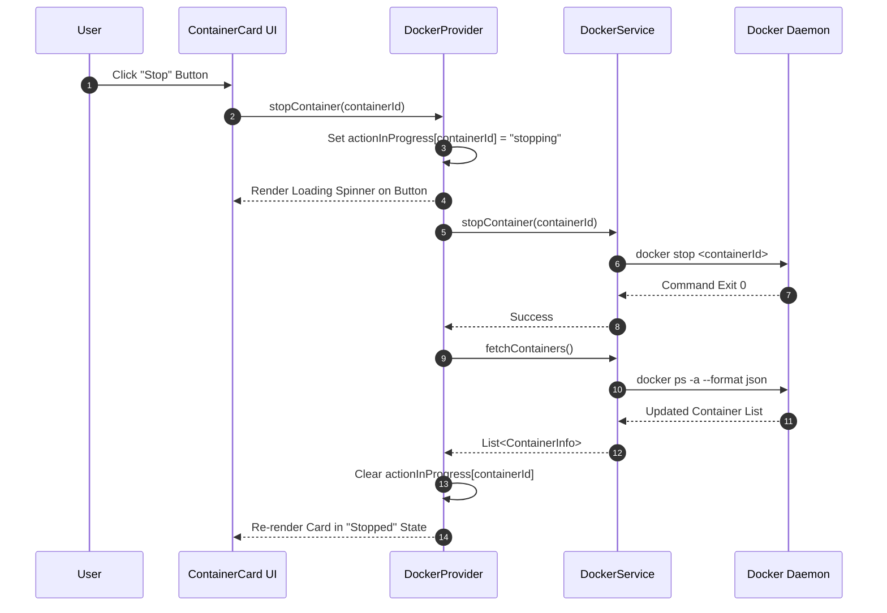

# Software Architecture & Design Specification - DockerMon

## 1. System Overview

**DockerMon** is a lightweight, cross-platform ready native Linux desktop GUI client for monitoring and managing Docker containers. Built using Flutter Desktop (GTK+ engine) and Dart, it provides real-time visibility into container states (running, stopped, paused) and immediate execution of management commands (start, stop, restart, inspect, logs).

---

## 2. Architectural Principles & Layers

DockerMon follows a **Clean Layered Architecture** with strict separation of concerns, reactivity, and strict security boundary enforcement:

```
┌────────────────────────────────────────────────────────┐
│                   UI Presentation Layer                │
│    (MainDashboard, ContainerCard, LogsDialog, Header)   │
└───────────────────────────┬────────────────────────────┘
                            │ (Listens to state changes)
┌───────────────────────────▼────────────────────────────┐
│                    State Management                    │
│             (DockerProvider / ChangeNotifier)          │
└───────────────────────────┬────────────────────────────┘
                            │ (Executes async commands)
┌───────────────────────────▼────────────────────────────┐
│                   Service & Domain Layer               │
│               (DockerService / Data Models)            │
└───────────────────────────┬────────────────────────────┘
                            │ (Communicates via CLI/Socket)
┌───────────────────────────▼────────────────────────────┐
│                 OS & Docker Engine Layer               │
│       (/var/run/docker.sock / Unix IPC / docker CLI)   │
└────────────────────────────────────────────────────────┘
```

### Key Architectural Traits
1. **Unidirectional Data Flow**: UI dispatches intent actions to `DockerProvider` -> `DockerService` executes OS command -> Provider updates state -> UI re-renders reactively.
2. **Fault Tolerance & Resilience**: Network/socket disconnects or permission errors trigger dedicated fallback UI views rather than app crashes.
3. **Non-Blocking Execution**: All OS operations and subprocess spawns run asynchronously off the main UI rendering thread.

---

## 3. Component Specification

### 3.1 Domain Model (`ContainerInfo`)
An immutable representation of a Docker container instance.

```dart
class ContainerInfo {
  final String id;
  final String name;
  final String image;
  final String state;   // "running", "exited", "paused"
  final String status;  // e.g. "Up 3 hours", "Exited (0) 5 minutes ago"
  final String created;
  final List<String> ports;

  bool get isRunning => state.toLowerCase() == 'running';
  bool get isStopped => state.toLowerCase() == 'exited' || state.toLowerCase() == 'created';
}
```

### 3.2 Service Layer (`DockerService`)
Abstracts communication with Docker. Employs a dual-mode strategy:
1. **Primary**: Docker CLI execution layer (`process_run`) targeting `docker ps -a --format json`, `docker start <id>`, `docker stop <id>`, `docker inspect <id>`, `docker logs <id>`.
2. **Permission Check**: Verifies read/write access to `/var/run/docker.sock` and existence of `/usr/bin/docker`.

### 3.3 State Provider Layer (`DockerProvider`)
Maintains session state:
- `containers`: List of parsed `ContainerInfo`.
- `filterQuery`: Text search term.
- `selectedStatusFilter`: Enum (`All`, `Running`, `Stopped`).
- `connectionStatus`: Enum (`Connected`, `PermissionDenied`, `DaemonNotRunning`, `DockerNotInstalled`).
- `actionInProgress`: Map tracking loading states per container ID (`<containerId, String action>`).
- `autoRefreshEnabled`: Boolean flag controlling the 3-second `Timer.periodic` polling cycle.

---

## 4. Sequence Diagrams

### 4.1 Application Startup & Health Check Flow



### 4.2 Container Action Execution Flow (e.g. Stop Container)



---

## 5. Security & Privilege Specification

| Dimension | Plaintext Sudo Password Storage (Rejected) | Docker Group Authorization (Selected) |
|---|---|---|
| **Mechanism** | Storing `sudo` password in config file / environment | One-time system grant: `sudo usermod -aG docker $USER` |
| **Privilege Scope** | Unrestricted root access over whole OS | Scoped specifically to Docker Unix Socket IPC |
| **Exposure Vector** | Compromised config file exposes root password | Standard UNIX filesystem permission (`/var/run/docker.sock`) |
| **User Experience** | Manual password entry / unsafe disk storage | Transparent, silent, passwordless operations |

---

## 6. Future Extensibility Roadmap

The modular architecture accommodates future feature expansions without breaking existing layers:
1. **Container Logs Streamer**: WebSocket / Stream subscription using `docker logs -f`.
2. **Container Stats Visualizer**: Real-time CPU, RAM, and Network I/O metrics streaming via `docker stats --format json`.
3. **Docker Compose Stack View**: Grouping containers by `com.docker.compose.project` label.
4. **Container Launch Wizard**: Modal form UI for `docker run` (image select, port mapping, env vars).
